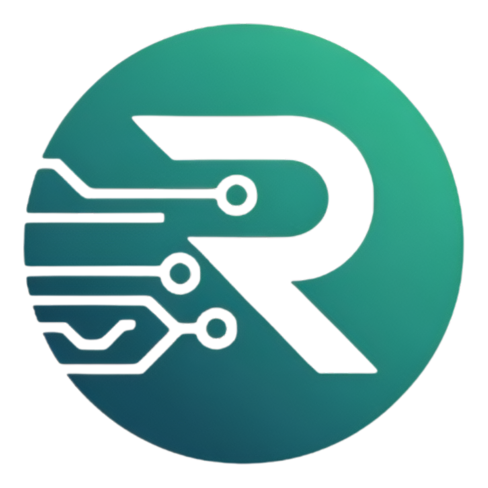

# Repository – A Hackathon-Focused Developer Community

  
  
<em>Empowering Student Innovation Through Code</em>

*Welcome to Repository!*  
A student-led tech community for hackathon enthusiasts at *BPPIMT and beyond*.

We focus on rapid learning, collaboration, and innovation through three core groups:

- *AI/ML* – Build intelligent, data-driven solutions  
- *Web Dev* – Create fast, scalable web apps  
- *App Dev* – Design impactful mobile experiences  

From prep sessions to team-ups, Repository is your launchpad for hackathon success.

> *Code. Collaborate. Conquer.*

---

## What We Do

- Host hackathon prep sessions  
- Build and showcase innovative projects  
- Connect like-minded students  
- Promote continuous learning and mentorship  
- Celebrate community wins and progress

---

## Stay Connected

- *Website:* [Repository](https://repository-main.vercel.app/)  
- *Instagram:* [@repository_bppimt](https://instagram.com/repository_bppimt) 
- *Email:* repositorycore@gmail.com 
- *Join our community:* [WhatsApp](https://chat.whatsapp.com/DuEKwdOeedk2R564i2Ri5A)

## 🛠 Tech Stack of the website

- **Frontend Framework:** Next.js
- **Styling:** SCSS Modules
- **Animation:** CSS Animations & Custom Scrollytelling
- **Deployment:** Vercel

## 🤝 Contributing

We welcome contributions! See our [CONTRIBUTING.md](CONTRIBUTING.md) for guidelines.

## 📜 License

This project is licensed under the MIT License - see the [LICENSE](LICENSE) file for details.

## 🙌 Core Team

- **Project Lead:** Saptarshi Ghosh
- **Frontend & Design Lead:** Aniket De
- **Community Manager:** Ootso Dhar Chowdhury

---

  Made with ❤️ by the <strong>Repository Core Team</strong>
   
  © 2025 CBWW Team. All Rights Reserved.

